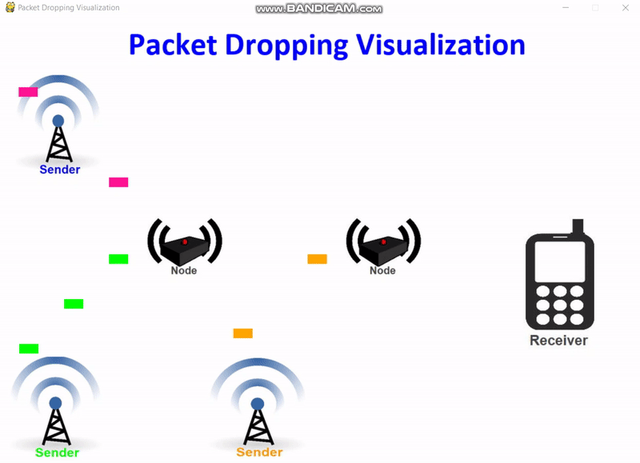

# Packet-Drop-Visualization-in-Computer-Network
Its the Basic visualization of packet droping in computer Netwowrk

# Explaination
* There are 3 senders, 2 routers and 1 receiver.
* Sender are sending the packets according to their speed and bandwidth.
* Packets are stored inside the routers buffers for processing.
* Packets colored red are dropped by routers due to congestion.
* Buffers of routers and receivers are predefined.

# Visualization Explanation
* There is a handler i.e the visualize class that has all the objects of packets or nodes or receiver as a list that are in a frame.
* At run time or inside the game loop, every object in the list is changing its state due to some event.
* Some example events are crashing of packet with the router,changing the direction of packet,changing the buffer view,changing the color etc.
* Each class Packet,Node,Sender has properties like move,changedirection and so on.

# How to Run it.
* Install Pygame module
* Clone this repo
* Change the parameters in mainpy.py(for changing the speed of packets , bandwidth or buffer size of any router or any properties.)
* run the mainpy.py

